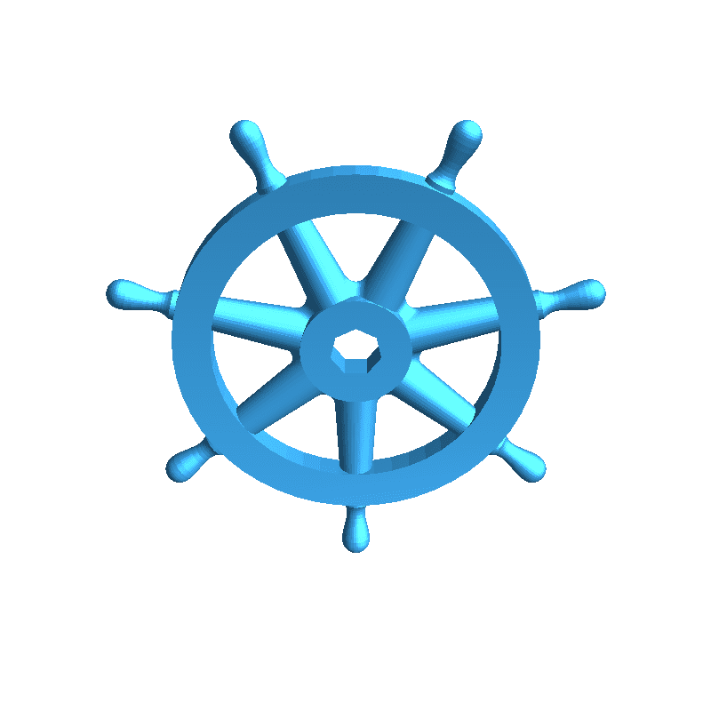

<h1>
  
  <a href="https://k8skit.pendela.in/">K8s ToolKit</a>
</h1>

> A comprehensive web-based dashboard for discovering, managing, and understanding Kubernetes tools and plugins.

## Features

- **Tools Directory**: Browse 100+ Kubernetes tools categorized by function.
- **Plugin Catalog**: Explore `kubectl` plugins for extended cluster management.
- **Version Tracker**: Detailed feature changelog for Kubernetes releases (1.27-1.36).
- **Architecture Explorer**: Visual map of control plane components.
- **YAML Generator** : Generate YAML files for Kubernetes resources.
- **Cloud Cost Calculator**: Calculate the cluster cost based on the number of nodes and pods.
- **kubectl Cheatsheet**: Quick reference for common `kubectl` commands.
- **KUBECTL command builder**: Generate `kubectl` commands for common operations.
- **Accessibility**:  for all users.

## Getting Started

### Prerequisites
- Node.js >= 18
- npm

### Installation
```bash
npm install
```

### Development
```bash
npm run dev
```

### Build for Production
```bash
npm run build
```

### Run in Docker
```bash
docker build -t k8s-toolkit .
docker run -p 8080:80 k8s-toolkit
```

## Coming Soon

- Real-time validation against cluster versions
- Helm chart generation
- GitOps-style export templates

---

Feel free to contribute, file issues, or request features!